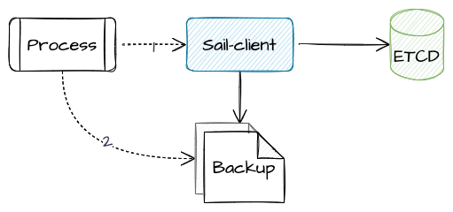

sail-client-go
---

1. SDK 集成

类似 Nacos、Apollo 都是这种方式，提供一个语言特定的 sdk，集成 sdk 即可。

2. sidecar 外挂

类似 confd 是这种方式，外挂一个进程，专门负责输出和更新配置文件，程序还是读取配置，侵入性小。


这两种方式，sail 的 client 都是支持的，请看下图：



由于 sail-client 会把从 etcd 中读取的配置备份到文件，并保持文件内容的更新，所以，从使用者的角度来说， 既可以把 sail-client 集成到代码中，也可以单独运行 sail-client，然后去读取备份的配置文件。

### 安装

代码接入：

```
go get github.com/HYY-yu/sail-client
```

单独运行：

```bash
git clone https://github.com/HYY-yu/sail-client.git
# 修改 cfg.toml 为你的配置
vim cfg.toml
go build -o service ./cmd/main.go
./service

# 打包成 docker 镜像
CGO_ENABLED=0 GOARCH=amd64 GOOS=linux go build -o service ./cmd/main.go
docker build --build-arg=serviceName=sail-client -f ./deploy/Dockerfile .
```

